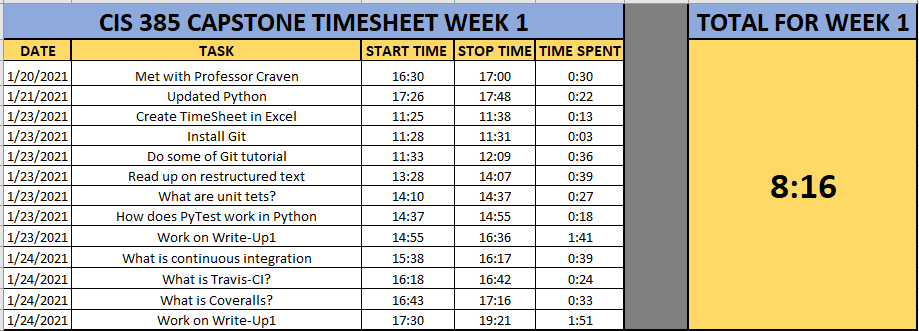

CAPSTONE Week 1 Write Up
========================

On Wednesday, January 20th, I met with Professor Craven for 30 minutes to talk
over the game plan for the coming Semester.  He walked me through what to expect
for not only this semester, but this week as well. He gave me a detailed list to
complete this week, which is the details are as follows.

On January 21st, I updated the Python I had on my home PC to 3.9.1. This took
right at 22 minutes but wasn't too bad as I already had Python on my system.
I did have a couple of hiccups as I have not used it in quite some time so had
to do several updates to bring it current.

On Saturday, January 23rd, I did the bulk of my task list by creating a
timesheet in excel, which took 13 minutes. I will utilize this to keep track of
my time during this semester and will attach at the end to show the exact times
spent. I installed Git, which only took 3 minutes as well as spending 36 minutes
completing the first 5 tutorials. Introduction to Git commits, Branching in Git,
Merging in Git, Rebase Introduction, Detach yo’ HEAD. I spent 39 minutes reading
up on restructured text, which is the default plaintext markup language used by
Sphinx.

I also spent 27 minutes doing some research on unit tests utilizing the
following link (https://realpython.com/python-testing/), which is one of the
4 write-ups Paul asked me to complete.

What are unit tests?
--------------------

Unit Tests check that a single component operates in the right way. They help to
isolate what is broken in the application and help to fix it faster. Rather than
checking to see if an entire application works, Unit Tests break the entire
application down into smaller tasks and test them individually.

From there, I spent 18 minutes researching another assigned write-up which was…

How does PyTest work in Python?
-------------------------------

PyTest furthers Unit Tests by supporting the execution of unittest test cases.
The biggest advantage is the ability to write pytest test cases. These test
cases are a series of functions in a Python file that start with the
name "test\_". PyTest supports the assert statement instead of being forced to
use the special self.assert*() method. It supports filtering for test cases. It
has the ability to rerun from the last test that failed. It also has hundreds of
plugins that even further the functionality.

On Sunday, January 24th, I spent 39 minutes researching continuous integration
which is another one of my write-ups this week. According to ATTLASIAN.
“Continuous integration (CI) is the practice of automating the integration of
code changes from multiple contributors into a single software project. It’s
primary DevOps best practice, allowing developers to frequently merge code
changes into a central repository where builds and tests then run. Automated
tools are used to assert the new code’s correctness before integration.”

Continuous integration greatly reduces risk by merging changes back into the
main branch on a consistent basis (typically days). Finding and fixing smaller
problems along the way is a lot easier than finding and correcting a huge issue
down the road. Automation of your tests is crucial for continuous integration,
so your tests must be concise, According to ATTLASIAN, the 5 steps to Continuous
integration are

1. Start writing tests for the critical parts of your codebase.
2. Get a CI service to run those tests automatically on every push to the main
   repository.
3. Make sure that your team integrates their changes every day.
4. Fix the build as soon as it’s broken.
5. Write tests for every new story that you implement.

From there, I spent the next 24 minutes doing some research into Travis-CI.
According to their website, Travis-CI is a continuous integration platform that
supports the development process by automatically building and testing for
changes in your code. Providing feedback immediately upon the completion of the
change. It can also help automate other parts of your process by managing not
only notifications, but also deployments.

After doing some research on Travis-CI, I spent 33 minutes looking into
Coveralls. According to their website, “Coveralls is a web service to help you
track your code coverage over time and ensure that all your new code is fully
covered.”. The only prerequisite for Coveralls Cloud is that “Your code must be
hosted on GitHub, BitBucket, or GitLab”. Coveralls provides very comprehensive
and detailed testing information, allowing you to access that information very
quickly and easily. It is very easy to integrate with many popular CI services
such as GitHubCI, Atlassian Bamboo, Travis CI, as well as Travis Pro and
programming languages, such as Python, Java, JavaScript, Node, PHP, and many
others.

After spending some time this week working on the above. Doing research into
continuous integration, Travis CI, and Coveralls, it’s nice to see the light at
the end of the tunnel when you realize how they all tie together. Unit tests are
the building blocks of automating testing. Ensuring that each line of your code
is accurate and concise is vital to smooth integration and testing. From there,
continuous integration, which is the process of merging small code changes
often, rather than large changes near the end of a development cycle, keeps your
code up to date for all users. Then, you can utilize a service such as
Travis CI, who will “clone your GitHub repository when you run a build.
Travis CI will put that clone into a brand-new virtual environment and carry out
a series of tasks to build and test your code.”

I can easily see how easily it can be to get large chunks of code written in a
short amount of time. If developers don’t have to spend a lot of timing figuring
out and fixing large scale problems at the end of the release, it free’s up time
to move onto the next project, and next line of code. Fixing small scale
problems regularly, also helps developers elevate their skills, by learning from
those small problems, developers learn to correct them in their next project,
making for a smoother development cycle.

I can’t wait to see what this semester brings.  I have only spent a small amount
of time in this Project and I an already tell that I will be learning a lot.
Getting my feet wet with base information and knowledge also helps me to put a
face with the name so to speak.  I’ve heard of many of these terms throughout my
journey here at Simpson College, but it’s nice to dig in a little bit and see
what they actually do. I think the Cloud, and what we, as programmers have done
to it are astonishing!  Not too long ago, having the internet whatsoever ever
was a rare commodity. I remember teachers in high school telling me that I will
ever just have a calculator on me. Now I not only have a calculator in the palm
of my hand, I also have access to literally endless forms of data and
information. It’s what drew me to Computer Science, and Computer Information
Systems in the first place. I can’t wait until I put all this knowledge to work
and feel that satisfaction once an app/program/code is up and running
successfully.

I have written small programs throughout my classes here, from a Python program
that you could play paper/rock/scissors with, or a website showcasing my love of
BBQ, but I have never truly built an application. I found a new hobby recently,
in First Person View (FPV) Drone Racing, seeing firsthand how amazing this hobby
is, it’s amazing to see and learn just how things like this can be accomplished.
There is code in almost everything we do, and I’d like to join the millions of
programmers in knowing that we made life a little bit easier.

Week 1 Time Sheet
-----------------

