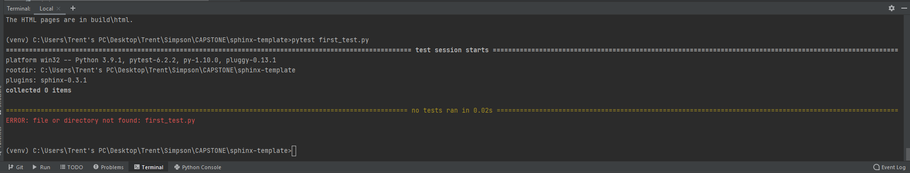
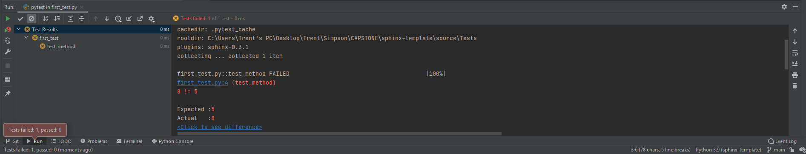
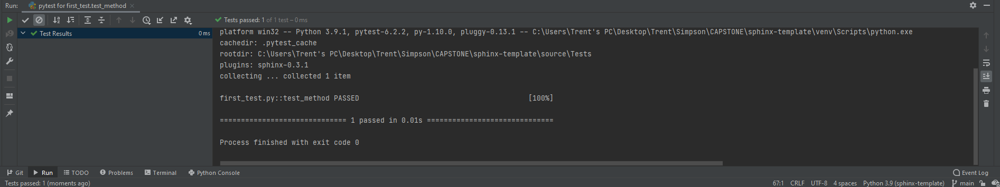
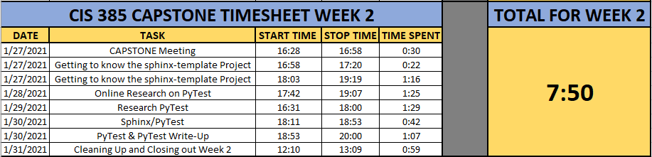

PyTest Week 2 Write Up
======================

On Wednesday, January 27th, I met with Professor Craven and we went over our
game-plan for the week. For this weeks write-up for my CIS CAPSTONE, I was
tasked with doing some more research into Unit Testing, as well as getting
PyTest to work on my system.

After our meeting Wednesday evening, I spent 1:38 playing around in Sphinx and
getting to know the environment. I added a couple Chapters to my Continuous
Integration Project, as well as a brief explanation of the site as a whole but
am having some issues getting them to all show correctly.

Here is a brief explanation of my issue
---------------------------------------

1. From the Home screen, I see all 4 Chapters, but when I click on "CAPSTONE
   Week 1 Write Up", I lose the ability to click on Chapter 4 "More Chapter
   Testing"
2. If I click on Chapter 2 "Getting PyTest to Work", I keep all 4 chapters in my
   side nave bar.
3. If I click on Chapter 3 "Testing Chapter 3", I lose the ability to click on
   both Chapters 3 and 4.

I will continue testing this over the coming days and see if I can get to the
bottom of the issue.  I believe there is a formatting issue as the chapter3
index.rst & chapter4 index.rst have green file names rather than blue that
Professor Craven created. I will continue doing some research into this issue
and hope to have it figured out prior to our meeting Wednesday afternoon.

On Thursday, January 28th, I spent 1:25 doing some research into PyTest online.
Namely watching some YouTube videos like
(https://www.youtube.com/watch?v=byaxg00Gf9I). This video by edureka! was very
informative but did not work as I've learned that things run differently
depending on the IDE, version, and programs being used.

On Friday, January 29th, I spent another 1:29 researching Unit testing and
PyTest from numerous sites online, as well as a couple Python books I own,
trying to gain as much information and knowledge that I could in a short amount
of time.

I wanted to get my feet wet so I created a sample test titled ``first_test.py``
utilizing the following code..

.. code-block:: python
    :linenos:

    def func(x):
        return x + 5

    def test_method():
        assert func(3) == 5

As I'm sure you noticed, this test would surely fail since 8 (x=3 + 5) is not
equal to 5. I did this on purpose to see if my test would fail.

On Saturday, January 30th, is when I really started to play around, I
investigated my above issue regarding my Chapters showing correctly but will
have to either ask for some help or continue trying to figure it out. Saturday
is also when I got into the bulk of getting PyTest to work on my system.  I
installed PyTest by entering "pip install -U pytest" into the command line.

If you are using PyCharm, you can install it there as well. I kept getting the
following error while entering "pytest first_test.py" into the command line::

    ERROR: file or directory not found: first_test.py

I then did some more research into why the test was failing and installed PyTest
for sphinx by entering the following into the command line:

.. code-block:: python

    pip install pytest-sphinx

I received a passing message on this so again ran the "pytest first_test.py"
into the command line and received the same error above.

.. literalinclude:: ../Tests/first_test.py
   :linenos:

From there, I started to feel defeated but did some more research online and
learned that since I am using PyCharm, I could highlight my program, Right Click
on it and click on the "Run 'pytest in first_test'" and it failed with the
following error::

    ERROR: file or directory not found: first_test.py

EUREKA! Not only did PyTest run, but it also failed because 8 != 5, just as I
had planned. That's what we were looking for. I then went in and corrected my
test with the following code and ran PyTest again.

.. code-block:: python
    :linenos:

    def func(x):
            return x + 5

    def test_method():
        assert func(3) == 8

This time, it passed. Yay me!

It's truly amazing to learn just how minor changes here or there can make such
a huge difference in coding. a missed close paren, a missed closing 
,
everything matters, and attention to detail is CRUCIAL. I spent nearly 3 hours
this week researching PyTest and Unit Testing and it's such an amazing feeling
trouble shooting and figuring things out. Getting code to work that you were
struggling with is such a great feeling. I can't wait to see what this CAPSTONE
has in for me over the coming months.

I will continue to work on my Chapter issues and hope to have them figured out
prior to my next meeting with Paul on Wednesday, February 3rd.

Week 2 Time Sheet
-----------------

