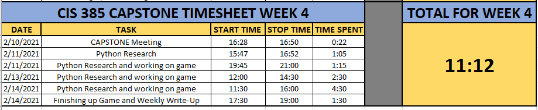

Trent's Adventures in Python
============================

So for Week 4, I met with my professor on 2/10/21 for right at half an hour
to discuss my progress, along with setting some goals and plans for the future.

After spending the last couple weeks researching pytest in all it's glory,
I get to put that knowledge into action.  I was tasked with creating a
Python program, and implementing pytest into it. Creating a small Python
program, then not only creating creating tests to test the program, but also
to implement those tests into my program.

Adventures In Python
--------------------

My professor and I decided to go with a small Python program in the form of a
Text-Based Adventure Game.  Eat your heart out Zork!

As it had been several years since I used Python, I spent an hour and 5
minutes on Thursday, February 11th doing some refresher in Python
(syntax, reserved keywords, etc.). It was then that I realized that I learn
much better by doing, rather than by reading. So I opened up PyCharm and
got to work and spent an hour and 15 minutes starting my journey.

To say I was rusty would be an understatement!

Being that it is Valentine's Day, in Iowa, during a Polar Vortex (it's currently
-8° Fahrenheit outside), I decided to make my little game about the weather
and how it's so important to keep a good head on your shoulders, think of the
good, and power through.  I decided to call my game Adventures in Python!

The Adventure Continues...
--------------------------
While I didn't get my tests built out, or implemented, I did get the game
itself done and am honestly proud of my work (considering I haven't touched
Python in a few years). It's nothing amazing, but I'm proud of it. Source
Code can be found here..

.. code-block:: python
    :linenos:

    #Author: Trent Fulcher

    import sys
    import time

    a = 2
    b = 0.2

    def intro():
        print()
        time.sleep(b)
        print("OK, sweet, well, my name is Trent.")
        print()
        time.sleep(a)
        print("What is your name?")
        print()
        time.sleep(a)
        userName = input("Please enter your name followed by ENTER: ")
        print()
        time.sleep(b)
        print("Why hello there " + userName + ". Great to meet you!")
        print()
        time.sleep(a)
        print("Hate to be the bearer of bad news here but...")
        print()
        time.sleep(a)
        print("You find yourself in the Frozen Tundra of Iowa in February.")
        print()
        time.sleep(a)
        print("It is -8° Fahrenheit outside!!!")
        print()
        time.sleep(a)
        print("There is snow on the ground!")
        print()
        time.sleep(a)
        print("The wind is blowing!")
        print()
        time.sleep(a)
        print("It's so cold that even Polar Bears think its cold!")
        print()
        time.sleep(a)
        print()
        print("You have 3 Choices")
        print("------------------")
        time.sleep(a)
        print("Option 1: Do you cuddle up in bed and take a nap?")
        time.sleep(a)
        print("Option 2: Do you sit by the fireplace and watch some TV?")
        time.sleep(a)
        print("Option 3: Do you say screw it, I only live once, I'm going to go "
              "outside and take some pictures of this beautiful snow?")
        print()
        time.sleep(a)
        print("Which Option do you choose? (1/2/3)")
        print()
        time.sleep(b)
        firstChoice = input("Please enter '1', '2', or '3' followed by ENTER: ")

        if firstChoice == '1':
            print()
            choice1()
        elif firstChoice == '2':
            print()
            choice2()
        elif firstChoice == '3':
            print()
            choice3()

    def choice1():
        print("")
        time.sleep(a)
        print("Not a bad idea.")
        print()
        time.sleep(a)
        print("You go to the restroom.")
        print()
        time.sleep(a)
        print("You crawl into bed to take a nap.")
        print()
        time.sleep(a)
        answerPhone = input("JUUUUUST as you are about to fall asleep, "
                            "your phone rings. Do you answer it? (Y/N): ")
        print("---------------------------------------")

        if answerPhone =='y' or answerPhone == 'Y':
            print()
            choice1_a()
        elif answerPhone == 'n' or answerPhone == "N":
            print()
            choice1_b()

    def choice1_a():
        print("Guess What? Your car warranty is about to expire!!")
        print()
        time.sleep(a)
        print("You get angry as this is the 7,387th call and you are no "
              "longer tired.")
        print()
        time.sleep(a)
        print("It's still VERY cold outside!")
        print()
        time.sleep(a)
        print("You are angry!")
        print()
        time.sleep(a)
        print("You are COLD")
        time.sleep(a)
        print("You realize that all hope is lost and your day is wasted!")
        print()
        time.sleep(a)
        print("YOU LOSE..")
        print()
        time.sleep(a)
        print("Thank you for playing!!!")
        time.sleep(a)
        print("Good Bye")
        time.sleep(a)

    def choice1_b():
        print("Great Choice. It was probably about your car insurance warranty "
              "anyways.")
        print()
        time.sleep(a)
        print("After a little bit of tossing and turning, you fall asleep for a "
              "few hours to grab a much-needed, and well deserved nap.")
        print()
        time.sleep(a)
        print("As you awake...")
        print()
        time.sleep(a)
        print("The sun is shining!")
        print()
        time.sleep(a)
        print("It's still cold outside, but you are well rested and ready to "
              "conquer the day!")
        print()
        time.sleep(a)
        print("You realize that while it may be cold outside, you can still "
              "accomplish a lot while staying indoors.")
        print()
        time.sleep(a)
        print("You hang out with your family!")
        print()
        time.sleep(a)
        print("You play some video games, you pick up the house, do some laundry "
              "and even squeeze in a little bit of TV by the fireplace.")
        print()
        time.sleep(a)
        print("Life is GREAT!")
        print()
        time.sleep(a)
        print("YOU WIN!!!")
        print()
        time.sleep(a)
        print("Thank you for playing!!!")
        print()
        time.sleep(a)
        print("Good Bye")
        time.sleep(a)

    def choice2():
        print("Not a terrible idea. You light the fireplace and snuggle into your "
              "favorite chair to watch some TV.")
        print()
        time.sleep(a)
        print("As you enjoy some rest and relaxation, you start to get sleepy.")
        print()
        time.sleep(a)
        takeNap = input("Do you take take a nap or power through? Please press "
                        "'Y' to take a nap, or 'N' to Power Through: ")

        if takeNap == 'y' or takeNap == 'Y':
            print()
            choice2_a()
        elif takeNap == 'n' or takeNap == 'N':
            print()
            choice2_b()

    def choice2_a():
        print("NICE!!!")
        print()
        time.sleep(a)
        print("As you sit in your favorite chair, comfortable and warm from the "
              "fireplace.")
        print()
        time.sleep(a)
        print("You drift off to sleep....")
        print()
        time.sleep(a)
        print("Upon awakening, you realize it is now 7:17pm and you have just "
              "taken a 6 hour nap.")
        print()
        time.sleep(a)
        print("Your sleep cycle is all sorts of off and you are groggy.")
        print()
        time.sleep(a)
        print("You don't get back to sleep until 3:30 in the morning.")
        print()
        time.sleep(a)
        print("Due to lack of productivity from being tired.")
        print()
        time.sleep(a)
        print("You lose your job......(I know right)")
        print()
        time.sleep(a)
        print("YOU LOSE!!!")
        print()
        time.sleep(a)
        print("Thank you for playing!!!")
        print()
        time.sleep(a)
        print("Good Bye")
        time.sleep(a)

    def choice2_b():
        print("There we go, always moving forward.")
        print()
        time.sleep(a)
        print("I like your attitude!")
        print()
        time.sleep(a)
        print("You get up from your chair and get some work done around the house.")
        print()
        time.sleep(a)
        print("You hang out with your family and play some board games.")
        print()
        time.sleep(a)
        print("In between turns, you look outside and see the snow blowing "
              "in the wind.")
        print()
        time.sleep(a)
        print("You realize that while the weather outside may indeed be "
              "frightful.")
        print()
        time.sleep(a)
        print("You have so much to be thankful for and that life is good!")
        print()
        time.sleep(a)
        print("YOU WIN!!!")
        print()
        time.sleep(a)
        print("Thank you for playing!!!")
        print()
        time.sleep(a)
        print("Good Bye")
        time.sleep(a)

    def choice3():
        print()
        time.sleep(a)
        print("Well, that didn't go as expected.")
        print()
        time.sleep(a)
        print("Not gonna lie, didn't see this coming...")
        print()
        time.sleep(a)
        print("um......")
        print()
        time.sleep(a)
        print("Did you not read above where I told you it was -8° Fahrenheit "
              "outside?")
        print()
        time.sleep(a)
        print("Alright, so yeah.. um.... here we go I guess.")
        print()
        time.sleep(a)
        print("You bundle up and go out to take some photos of the snow.")
        print()
        time.sleep(a)
        print("While taking some photos of the snow...")
        print()
        time.sleep(a)
        print("You slip and fall on some ice and break your leg!")
        print()
        time.sleep(a)
        print("During the fall, your phone breaks.")
        print()
        time.sleep(a)
        print("You can't call for help.")
        print()
        time.sleep(a)
        print("You die from hypothermia!!")
        print()
        time.sleep(a)
        print("YOU LOSE!!!")
        print()
        time.sleep(a)
        print("Thank you for playing!!!")
        print()
        time.sleep(a)
        print("Good Bye")
        time.sleep(a)

    print()
    print()
    print("               $$$$$$$$$$$$$$$$$$$$$$$$$$$$                        ")
    print("               $                          $                        ")
    print("               $   Adventures in Python   $                        ")
    print("               $                          $                        ")
    print("               $$$$$$$$$$$$$$$$$$$$$$$$$$$$                        ")
    print("                     by: Trent Fulcher                             ")
    print()
    print()
    time.sleep(a)
    print("Well hello there. Would you like to play a little game?")
    print()
    time.sleep(a)
    startGame = input("Please select 'Y' or 'N' followed by ENTER!")

    if  startGame == 'n' or startGame =='N':
            print()
            time.sleep(a)
            print("OK, well boo. Maybe next time. Have a great day!")
            print()
            time.sleep(a)
            print("Good Bye")
            time.sleep(a)
    elif    startGame == 'y' or startGame == 'Y':
        intro()
    elif    startGame != 'y' or startGame != 'Y' or startGame != 'n' or startGame != "N":
        print()
        time.sleep(a)
        print("That was an invalid entry")
        print()
        print("Please select 'Y' or 'N' followed by ENTER!")

I know right.. Pretty impressive right..

I know. It's nothing amazing, but still, it's pretty cool to see what can be
done with code and like 7 hours.

The Adventure Awaits..
----------------------

Going forward, I plan on working to implement my tests and test my code. I will
really need to do some research on coverage and how to go about making sure
every little bit of your code is tested in some sort of way. Some functions
and code don't need as elaborate testing as others. That will be the tricky
part I believe. Not only figuring out HOW to test, but figuring out WHAT to
test. It will be an Adventure, that's for sure!

Week 4 Time Sheet
-----------------

