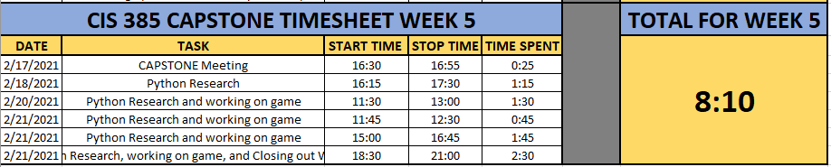

The Adventure Continues (ever so slowly...)
===========================================

This week, I met with Professor Craven on Wednesday, February 17th for 25
minutes to go over my progress thus far during this Project, as well as the
plan going forward. As the program that I created wasn't easily testable so I
had to go back to the drawing board and recode the entire project. Isn't
learning fun?

After some conversation, we decided it would likely be my best bet if I
basically followed Pauls tutorial located here
https://learn.arcade.academy/labs/lab_06_text_adventure/adventure.html

Sample Run:
-----------

You are in a dusty castle room.
Passages lead to the north and south.
What direction? n

You are in the armory.
There is a room off to the south.
What direction? s

You are in a dusty castle room.
Passages lead to the north and south.
What direction? s

You are in a torch-lit hallway.
There are rooms to the east and west.
What direction? e

You are in a bedroom. A window overlooks the castle courtyard.
A hallway is to the west.
What direction? w

You are in a torch-lit hallway.
There are rooms to the east and west.
What direction? w

You are in the kitchen. It looks like a roast is being made for supper.
A hallway is to the east.
What direction? w

Can't go that way.
You are in the kitchen. It looks like a roast is being made for supper.
A hallway is to the east.
What direction?

First Major bump in the road (or should I say Room)
---------------------------------------------------

I sat down on Thursday, the 18th of February, I very quickly realized that my
Python programming was not up to par, as so much of the code provided in the
tutorial seemed like Greek. I just wasn't remembering Python the way I should.

I then spent an hour and 15 minutes on Thursday doing some more research into
Python to jog my memory and get this program up and running so I could have
not only the program up and running, but also a few tests to go along with it.

Then, over the coming weeks, I could work on adding more tests and ensuring I
have test coverage.

Well, lets just say that that did NOT go as planned. I REALLY struggled this
week with my Python and just had issues altogether. I spent an hour and a half
on Saturday, February 20th working on the Project, as well as several hours on
Sunday, but just couldn't wrap my head (and my code) around it all. I'm just
super rusty.  That is on me and a problem I will have to overcome in the coming
weeks and months.

The content makes sense, I just really struggle with the syntax. Where does this
method go? where does this semi-colon go? What about that missing paren? After
several hours on Sunday (not to mention throughout the week), I finally started
to make some progress. Not nearly as much as I was hoping for, but progress
nonetheless.

Here is the progress I have made this week on my Text Adventure Game.

.. code-block:: python
    :linenos:

    class Room:
    """
    This is a class that represents a room.
    """
    def __init__(self, description, north, south, east, west):
        """This is a method that sets up the variables in the object."""
        self.description = description
        self.north = north
        self.south = south
        self.east = east
        self.west = west

    def main():

        """Creating an empty array for the individual rooms to go into"""
        room_list = []

        """Create a few rooms"""
        southhall = Room("You are in the south hall.", 1, 1, None, 1)
        room_list.append(southhall)

        diningroom = Room("You are in the dining room", 1, None, None, 1)
        room_list.append(diningroom)

        bedroom1 = Room("You are in a bedroom", None, 1, 1, None)
        room_list.append(bedroom1)

        bedroom2 = Room("You are in a 2nd bedroom", 1, 1, None, None)
        room_list.append(bedroom2)

        northhall = Room("You are in the north hall", 1, 1, 1, 1)
        room_list.append(northhall)

        kitchen = Room("You are in the kitchen", None, None, 1, 1)
        room_list.append(kitchen)

        balcony = Room("You are standing on the balcony", None, None, 1, None)
        room_list.append(balcony)

        current_room = Room("", 0, 0, 0, 0)
        room_list.append(current_room)

        for current_room in room_list:
            print(current_room.description)

    # Call (run) the main function
    main()

As of now, when I run this, I get the description of all of the rooms, rather
than just the description of the current room. I am missing somewhere to
set the new room to the current room to only be printing in the description
of the room the user is currently in. I will submit what I have for tonight
but will be setting up some time to talk this over and get to the bottom of
this. I believe I am close, and in being close, I'm close to being able to
test to make sure our users can only go the directions available (what happens
if the user enters Q), and that everything is acting accordingly.

The Adventure Continues...
--------------------------
In the coming days, I plan on ironing out all of my issues with Adventures
In Python, as well as creating tests. I am behind on this Project, and I do NOT
like it. I am hoping it clicks soon and I can get caught up and proceed to
testing. I feel like I am spending a lot of time researching things I should
already know, but feel very foreign currently. I just haven't coded enough for
all of this to be second nature.

Week 5 Time Sheet
-----------------

