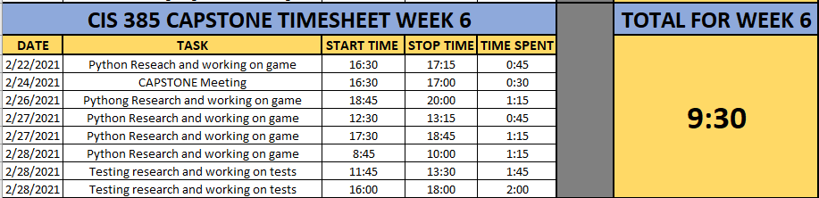

And we traveled further towards our destination!!
=================================================

I met with Professor Craven on Wednesday, February 24th for around 25 minutes
to go over my progress, and continue our path towards completion.  As we
noticed last week, the Text Adventure game that I had created was not easily
testable so I went back to the drawing board to re-write following Professor
Cravens Lab 6: Text Adventure.

It took me a little bit to wrap my head around the context and wrapping
everything into a list item. My brain just wasn't going there. Once I met
with Paul and he blessed me with that little kernal of knowledge, it was off
to the races.

Or so I thought...

As I've stated throughout this project, my coding skills just aren't up to the
level that I wish they were at.  This project is surely fine tuning those skills
and I can't wait to see where they are in 2 months when this class ends.

Anyways, I spent roughly 8 hours this week getting my text adventure game up
and running as well as researching unit testing.  I had some issues trying
to wrap my head around the context of the testing.  Do I put the tests in a
separate file named tests.py, do I write my tests within the code of my game.

That's the stuff that I am having issues with.  I have built some testing
into my code with if statements, but it is not where it should be.  I will
be setting up a meeting again with Paul prior to our meeting on Wednesday so I
can hopefully get some more tests completed prior to Wednesday, where I will be
meeting with him, going over next weeks assignment so to speak, and continuing
down the path of testing and testing coverage.

With that said, here is the progress I have made on my game..

.. code-block:: python
    :linenos:

    class Room:
    """
    This is a class that represents a room.
    """

    def __init__(self, description, north, south, east, west):
        """This is a method that sets up the variables in the object."""
        self.description = description
        self.north = north
        self.south = south
        self.east = east
        self.west = west

    """Defining out main program."""
    def main():

    """Creating an empty array for the individual rooms to go into"""
    room_list = []

    """Create a few rooms"""
    bedroom1 = Room("You are in a bedroom. \nThere is a door to the East, and a door to the North.", 3, None, 1, None)
    room_list.append(bedroom1)

    southhall = Room("You are in the south hall. \nThere is a door to the East, 1 to the West, and a door to the "
                     "North.", 4, None, 2, 0)
    room_list.append(southhall)

    diningroom = Room("You are in the dining room. \nThere is a door to the North, and a door to the West", 5, None,
                      None, 1)
    room_list.append(diningroom)

    bedroom2 = Room("You are in a bedroom. \nThere is a door to the South, and a door to the East.", None, 0, 4, None)
    room_list.append(bedroom2)

    northhall = Room("You are in the north hall. \nThere are doors in all directions.", 6, 1, 5, 3)
    room_list.append(northhall)

    kitchen = Room("You are in the kitchen. \nThere is a door to the South, and a door to the West", None, 2, None, 4)
    room_list.append(kitchen)

    balcony = Room("You are standing on the balcony. \nThere is a door to the South", None, 4, None, None)
    room_list.append(balcony)

    """Set the current Room to 0"""
    current_room = 0

    "Create a variable called done and set it to false"
    done = False

    while not done:
        print()
        print(room_list[current_room].description)
        direction = input("What would you like to do? \n"
                          "Please select 'N', 'S', 'E', or 'W'!(or press Q "
                          "to quit.)")

        """If the user selected 'N' or 'n'"""
        if direction == 'n' or direction == "N":
            next_room = room_list[current_room].north

            """Make sure the user entered the correct information"""
            if next_room is None:
                print()
                print("You can't go that way.")

                """Set the current room to equal the next room"""
            else:
                current_room = next_room

        """If the user selected 'S' or 's'"""
        if direction == 's' or direction == "S":
            next_room = room_list[current_room].south

            """Make sure the user entered the correct information"""
            if next_room is None:
                print("You can't go that way.")

                """Set the current room to equal the next room"""
            else:
                current_room = next_room

        """If the user selected 'E' or 'e'"""
        if direction == 'e' or direction == "E":
            next_room = room_list[current_room].east

            """Make sure the user entered the correct information"""
            if next_room is None:
                print("You can't go that way.")

                """Set the current room to equal the next room"""
            else:
                current_room = next_room

        """If the user selected 'W' or 'w'"""
        if direction == 'w' or direction == "W":
            next_room = room_list[current_room].west

            """Make sure the user entered the correct information"""
            if next_room is None:
                print()
                print("You can't go that way.")

                """Set the current room to equal the next room"""
            else:
                current_room = next_room

        """If user selects 'q' or 'Q', quit the game"""
        if direction == 'q' or direction == 'Q':
            print()
            print("Sorry to hear that, have a great day.")
            print()
            exit()

        if direction != 'n' and direction != 'N' and direction != 's' and \
           direction != 'S' and direction != 'e' and direction != 'E' and \
           direction != 'w' and direction != 'W' and direction != 'q' and \
           direction != 'Q':
            print()
            print("That is an invalid selection, please try again")

    # Call (run) the main function
    main()

As you can see above, I have some tests built into some if statements, but have
not quite wrapped my head around asserting errors, and fully testing. It is
completely frustrating and is driving me insane. I have spent something like
15 or 20 hours researching testing in Python, and I just can't seem to wrap my
head around it.  I understand the big picture, like we need to ensure the user
doesn't do anything silly, but just don't have the code knowledge to put my
thoughts into action.  Hopefully that comes to fruition shortly and I am REALLY
hoping I have an "aha" moment.

Week 5 Time Sheet
-----------------

