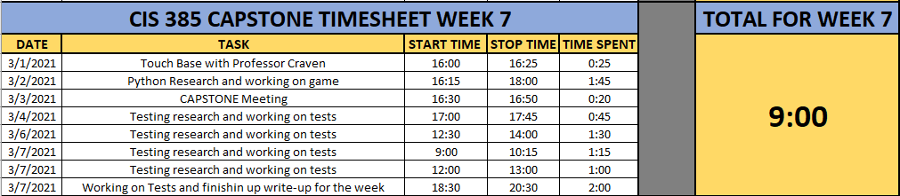

Our Destination Awaits!!!
=========================

I met with my professor Paul Craven again on Monday, March 1st for 25
minutes as I was having some issue with my code that I couldn't work out
on my own.  I had some formatting off and Paul was able to walk me through it.

On Tuesday, March 2nd, I spent some time working on my code for my Adventure
game and made some progress. I created some tests but they were not operating
correctly.  Looking back, I should have taken some screen shots and inserted
my code within this write-up.  I will keep that in mind going forward to
put my code in here to document my learning. Anyways, I again sat down with
Paul on Wednesday the 3rd for our weekly CAPTSONE meeting.  We decided for me
keep working on creating tests for my program, and ensuring that everything
runs smoothly. Once complete, we can work onto more complex testing, as well
as ensuring my game Adventures In Python has testing coverage.

Throughout the rest of the week, and the weekend, I continued to work out
kinks in my code, as well as adding some tests.  I do have to say this, finally
figuring out code errors is an amazing feeling.  I spent several hours this
week trying to figure out an error code I was getting.  Again, I should have
copied it and inserted it here to document it. My bad.  Essentially,  when
Paul and I updated my code on Monday and Wednesday, it broke another part
of my code as I failed to change the name of a variable.  I could traverse
between rooms, but the descriptions weren't changing.  I ended up getting
it figured out and man, itt is such an amazing feeling figuring these
things out and that feeling is happening more and more throughout this short
time during this project.

Anyways, you likely don't want to hear me babble so here is where I'm currently
at with Adventures In Python.  It's come a long way.  You can now easily
traverse between all of the rooms.  All rooms are acting accordingly. The user
can hit Q or q to quit. If the user selects anything other than what is
allowed, the user will get an error message.  Things are looking up.  I will
continue to work on some tests.  Right now, I'm struggling thinking of anything
other to test other than when the user wants to go north, are they actually
going north.  You know, making sure all the directions and rooms are in the
right order.  Other than that, I'm struggling to think of anything else to
test.  I am sure I'll think of some and will add accordingly.

Adventures In Python
--------------------
.. code-block:: python
    :linenos:

    class Room:
    # This is a class that represents a room.

    def __init__(self, description, north, south, east, west):
        # This is a method that sets up the variables in the object
        self.description = description
        self.north = north
        self.south = south
        self.east = east
        self.west = west

    class GameEngine:
    # This is a class that is used for testing the game

    def __init__(self):
        self.room_list = []
        self.current_room = 0

    # Function to take the user north
    def go_north(self):
        # If the user selected 'N' or 'n'
        next_room = self.room_list[self.current_room].north

        # Make sure the user entered the correct information
        if next_room is None:
            print()
            print("You can't go that way.")

        # Set the current room to equal the next room
        else:
            self.current_room = next_room

    # Function to take the user south
    def go_south(self):
        # If the user selected 'S' or 's'
        next_room = self.room_list[self.current_room].south

        # Make sure the user entered the correct information
        if next_room is None:
            print()
            print("You can't go that way.")

        # Set the current room to equal the next room
        else:
            self.current_room = next_room

    # Function to take the user east
    def go_east(self):
        # If the user selected 'E' or 'e'
        next_room = self.room_list[self.current_room].east

        # Make sure the user entered the correct information
        if next_room is None:
            print()
            print("You can't go that way.")

        # Set the current room to equal the next room
        else:
            self.current_room = next_room

    # Function to take the user west
    def go_west(self):
        # If the user selected 'W' or 'w'
        next_room = self.room_list[self.current_room].west

        # Make sure the user entered the correct information
        if next_room is None:
            print()
            print("You can't go that way.")

        # Set the current room to equal the next room
        else:
            self.current_room = next_room

    def quit_game(self):
        print()
        print("Sorry to hear that, have a great day.")
        print()
        exit()

    def user_input_check(self):
        print()
        print("That is an invalid selection, please try again")
        print()

    # Defining out main program.
    def main():

    # Creating an empty array for the individual rooms to go into
    game_engine = GameEngine()

    # Create a few rooms and add them to the list
    bedroom2 = Room("You are in a bedroom. \nThere is a door to the East, "
                    "and a door to the North.", 3, None, 1, None)
    game_engine.room_list.append(bedroom2)

    southhall = Room("You are in the south hall. \nThere is a door to the "
                     "East, 1 to the West, and a door to the North.", 4,
                     None, 2, 0)
    game_engine.room_list.append(southhall)

    diningroom = Room("You are in the dining room. \nThere is a door to the "
                      "North, and a door to the West", 5, None, None, 1)
    game_engine.room_list.append(diningroom)

    bedroom1 = Room("You are in a bedroom. \nThere is a door to the South, "
                    "and a door to the East.", None, 0, 4, None)
    game_engine.room_list.append(bedroom1)

    northhall = Room("You are in the north hall. \nThere are doors in all "
                     "directions.", 6, 1, 5, 3)
    game_engine.room_list.append(northhall)

    kitchen = Room("You are in the kitchen. \nThere is a door to the "
                   "South, and a door to the West", None, 2, None, 4)
    game_engine.room_list.append(kitchen)

    balcony = Room("You are standing on the balcony. \nThere is a door to the "
                   "South", None, 4, None, None)
    game_engine.room_list.append(balcony)

    # Set the current Room to 0
    current_room = 0

    # Create a variable called done and set it to false
    done = False

    while not done:
        print()
        print(game_engine.room_list[game_engine.current_room].description)
        print()
        user_input = input("What would you like to do? Please select 'N', 'S', "
                           "'E', or 'W'!(or press Q to quit.)")
        print()

        # If the user selected 'N' or 'n'
        if user_input == 'N' or user_input == "n":
            game_engine.go_north()

        # If the user selected 'S' or 's'
        if user_input == 'S' or user_input == "s":
            game_engine.go_south()

        # If the user selected 'E' or 'e'
        if user_input == 'E' or user_input == "e":
            game_engine.go_east()

        # If the user selected 'W' or 'w'
        if user_input == 'W' or user_input == "w":
            game_engine.go_west()

        # If user selects 'Q' or 'q', quit the game
        if user_input == 'Q' or user_input == 'q':
            game_engine.quit_game()

        # If user selects anything else
        if user_input != 'N' and user_input != 'n' and user_input != 'S' and \
           user_input != 's' and user_input != 'E' and user_input != 'e' and \
           user_input != 'W' and user_input != 'w' and user_input != 'Q' and \
           user_input != 'q':
            game_engine.user_input_check()

    if __name__ == "__main__":
        # Call (run) the main function
        main()

    # Add if's to a function to test to be able to test that function easily
    # def user_options
    # does it work if they put in fred
    # Did they actually move rooms

My Test Code
------------
.. code-block:: python
    :linenos:

    import unittest
    from room import Room
    from room import GameEngine

    class MyTestCase(unittest.TestCase):
        def test_something(self):
            self.assertEqual(True, True)

    if __name__ == '__main__':
        unittest.main()

    # Function to test the navigation between rooms
    def test_navigation():

    # Testing directions traveled are correct
    game_engine = GameEngine()
    room = Room("testroom", 3, None, 1, None)
    game_engine.room_list.append(room)
    game_engine.go_north()
    assert game_engine.current_room == 3

    game_engine = GameEngine()
    room = Room("testroom", None, None, 1, None)
    game_engine.room_list.append(room)
    game_engine.go_north()
    assert game_engine.current_room == 0

    game_engine = GameEngine()
    room = Room("testroom1", 1, None, None, None)
    game_engine.room_list.append(room)
    room = Room("testroom2", None, 0, None, None)
    game_engine.room_list.append(room)
    game_engine.go_north()
    assert game_engine.current_room == 1
    game_engine.go_south()
    assert game_engine.current_room == 0

Week 7 Time Sheet
-----------------

